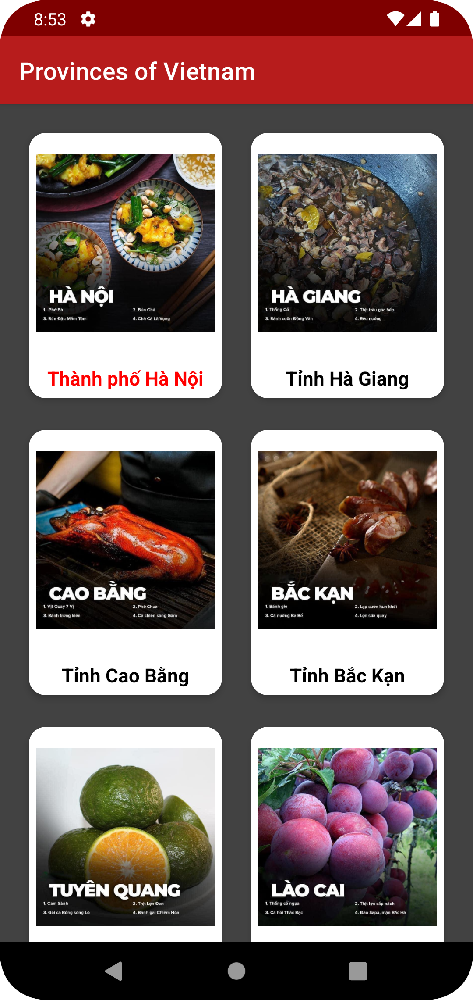

# Provinces of Vietnam

Một ứng dụng di động thể hiện danh sách các tỉnh của Việt Nam, được tạo ra trong quá trình mình học về Android.

Để lấy thông tin về các tỉnh thành, mình sử dụng API của [Province Open API](https://provinces.open-api.vn/)

## Screenshots

## Tech stack & thư viện sử dụng

- [Kotlin]()
- Jetpack
    - Lifecycle
    - ViewModel
    - DataBinding
    - Room Persistence
- [Retrofit2](https://github.com/square/retrofit) - Thiết lập kết nối để lấy thông tin từ API.
- [Moshi](https://github.com/square/moshi/) - Parse cấu trúc từ JSON sang Kotlin object, cụ thể là chuyển thành thông tin các tỉnh thành.
- [Glide](https://github.com/bumptech/glide) - Hiện thị ảnh, sử dụng Glide thay cho [Coil](https://github.com/coil-kt/coil) vì Glide hiển thị ảnh trong lúc không có kết nối internet.
- [Material](https://www.material.io/) - Thư viện giao diện.

## MAD Score
